# Cursor, motion and effects

VSNeo draws a lot more than Visual Studio's plain caret: a Neovide-style
cursor trail, particle and cyberpunk effects, a custom cursor with per-mode
colors and glow, smooth scrolling, a jump beacon, a mode-colored cursor line,
and Vim-style relative line numbers. This page shows each one and how to turn
it on.

- Every option, with defaults and ranges: [`options.md`](options.md).
- Writing your own effect: [`cursor-effects.md`](cursor-effects.md).
- A config with all of this spelled out: [`examples/vsneorc.lua`](../examples/vsneorc.lua).

Settings go in `~/.vsneorc.lua` (or `~/.vsneorc`), and `:source` applies them
live. The previews below are rendered from Python ports of the same drawing
code, not captured from Visual Studio.

## Quick start: presets

The fastest way to see everything at once is a preset: a whole look under
one name.

```vim
:VSNeoPreset blade_runner
:VSNeoPreset matrix
:VSNeoPreset cyberpunk2077
:VSNeoPreset none
```

`:VSNeoPreset` alone lists them, and Tab completes the names. To keep one
across restarts, put it in the rc:

```lua
vim.g.vsneo_preset = 'blade_runner'
```

| Preset | Look | Effects |
|---|---|---|
| `blade_runner` | orange / teal / magenta, expand blink | scanline, torpedo, flicker, sparks |
| `matrix` | phosphor green, red-pill replace, blue-pill visual, phase blink | matrix, sparks, flicker |
| `cyberpunk2077` | Night City yellow / netrunner cyan / Arasaka red, hard blink | glitch, circuit, scanline, sparks |

A preset is never written into your `vim.g` variables, so switching leaves
nothing behind. How presets and your own rc settings combine is in
[`options.md`](options.md#presets).

## Cursor trail

On by default. When the cursor moves, it smears from the old position to the
new one, like Neovide.

- **How it moves:** each corner of the cursor is a critically damped spring.
  The leading corners arrive first and the trailing ones catch up, so a jump
  stretches the cursor into a streak and then snaps it back. No overshoot.
- **Short moves** (typing, `h`/`l`, at most two columns on one line) use a
  much shorter animation, so typing stays crisp.
- **Holding `j`** retargets mid-flight; the springs keep their speed.
- **Visual mode:** the trail follows the block VSNeo draws over Vim's cursor
  character.
- **No animation** for scrolls and edits that don't move the caret, the
  command line, unfocused views, and a caret that's off screen.

```lua
vim.g.vsneo_cursor_animation_length = 0.13        -- seconds; 0 = no trail (Neovide: 0.150)
vim.g.vsneo_cursor_short_animation_length = 0.04  -- typing, h/l
vim.g.vsneo_cursor_trail_size = 0.8               -- 0..1, how far the tail lags (Neovide: 1.0)
vim.g.vsneo_cursor_animate_in_insert_mode = true
```

## Cursor effects

Off by default, as in Neovide. Pick one name, or a list to combine them:

```lua
vim.g.vsneo_cursor_vfx_mode = 'railgun'
vim.g.vsneo_cursor_vfx_mode = { 'circuit', 'glitch', 'sparks', 'flicker' }
```

Effects work with the trail on or off, and scale with the editor's zoom.
Changing the list and running `:source` swaps them live; an unknown name is
ignored.

### Neovide's effects

These six are Neovide's `neovide_cursor_vfx_mode` effects, ported unchanged.
They fire on every cursor move.

| railgun | torpedo | pixiedust |
|---|---|---|
| 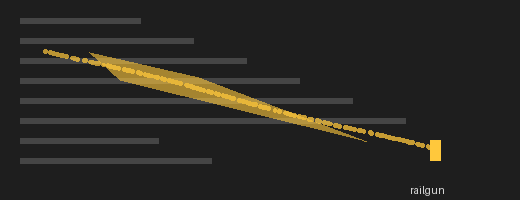 | 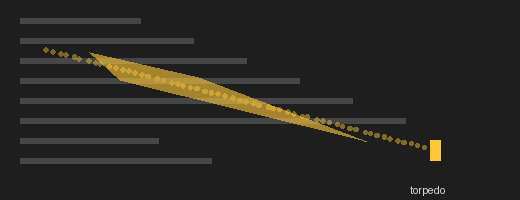 | 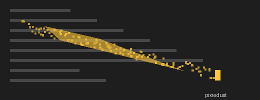 |
| a curling helix of particles along the path | exhaust puffs thrown back behind the cursor | sparkles shaken off, falling |
| **sonicboom** | **ripple** | **wireframe** |
| 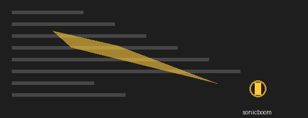 |  | 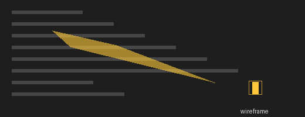 |
| a ring expanding from the destination | the cursor's outline rippling outward | a dashed box stretching wide |

### Cyberpunk effects

| glitch | matrix | circuit |
|---|---|---|
| 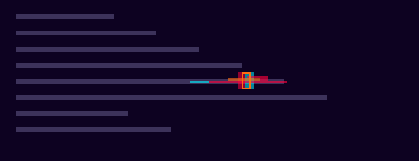 | 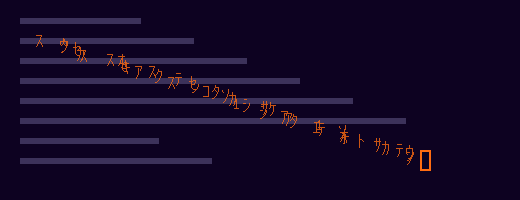 | 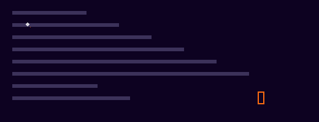 |
| red/cyan split copies and tear bars | katakana and 0/1 rain falling from the path | a right-angle neon trace from old to new position |
| **scanline** | **sparks** | **flicker** |
| 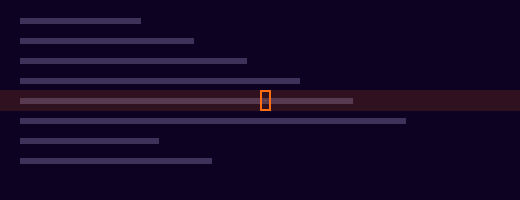 | 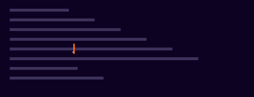 |  |
| a CRT band sweeping across the cursor's line | sparks off each typed character | the cursor stutters like a failing neon tube |

When each one fires:

| Effect | Fires on |
|---|---|
| `glitch` | jumps, mode changes, focus |
| `matrix` | jumps |
| `circuit` | jumps |
| `scanline` | jumps across lines, focus |
| `sparks` | typing in insert mode |
| `flicker` | mode changes, focus |

"Jumps" means real jumps: `G`, `n`, `}`, `w`, a mouse click. `glitch`,
`matrix` and `circuit` skip typing and single `h`/`j`/`k`/`l` steps, so they
don't fire on every keystroke.

### Tuning

```lua
vim.g.vsneo_cursor_vfx_opacity = 200.0                   -- 0..255
vim.g.vsneo_cursor_vfx_particle_lifetime = 0.5           -- seconds (matrix rain lives twice this)
vim.g.vsneo_cursor_vfx_particle_highlight_lifetime = 0.2 -- one-shot effects: rings, flashes, sweeps
vim.g.vsneo_cursor_vfx_particle_density = 0.7
vim.g.vsneo_cursor_vfx_particle_speed = 10.0
vim.g.vsneo_cursor_vfx_particle_phase = 1.5              -- railgun
vim.g.vsneo_cursor_vfx_particle_curl = 1.0               -- railgun, torpedo
```

Want an effect that isn't here? Each one is a single class; see
[`cursor-effects.md`](cursor-effects.md).

## Custom cursor

Off until you set a style, blinking or a color. It replaces Visual Studio's
caret with VSNeo's own, using VS Code's cursor shapes and blink styles.

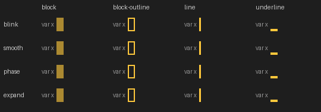

Shapes are the columns above, blink styles the rows.

```lua
-- 'block', 'block-outline', 'line', 'line-thin', 'underline', 'underline-thin'
vim.g.vsneo_cursor_style = { normal = 'block-outline', insert = 'line', replace = 'underline' }

-- 'blink', 'smooth', 'phase', 'expand' (shrinks to its centre), 'solid'
vim.g.vsneo_cursor_blinking = 'expand'
```

A string sets normal mode; a table sets any of `normal`, `insert`, `replace`,
`visual`, `operator` and `cmdline`. Blinking follows the system caret blink
rate. The fading styles run ten cycles, then hold solid. Unsetting the options
and running `:source` brings Visual Studio's caret back.

## Colors and glow

`vsneo_cursor_color` takes `'#rrggbb'` or a highlight group name, one for
every mode or a table per mode. Modes you leave out keep the theme's caret
color. A color given as a group name follows `:colorscheme`.

```lua
vim.g.vsneo_cursor_color = { normal = '#FF6C11', insert = '#2DE2E6', replace = '#F706CF', operator = '#FFD319' }
vim.g.vsneo_cursor_glow = true   -- a neon halo: true = 12 px, or a radius 0..60
```

Five cyberpunk palettes, with glow (each is a line in the sample rc to copy):

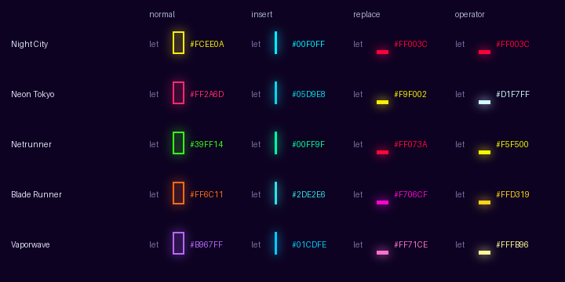

| Palette | normal | insert | replace | operator |
|---|---|---|---|---|
| Night City | `#FCEE0A` | `#00F0FF` | `#FF003C` | `#FF003C` |
| Neon Tokyo | `#FF2A6D` | `#05D9E8` | `#F9F002` | `#D1F7FF` |
| Netrunner | `#39FF14` | `#00FF9F` | `#FF073A` | `#F5F500` |
| Blade Runner | `#FF6C11` | `#2DE2E6` | `#F706CF` | `#FFD319` |
| Vaporwave | `#B967FF` | `#01CDFE` | `#FF71CE` | `#FFFB96` |

The color carries everywhere:
- The trail, the effects, the beacon and the mode line all use the cursor's
  current color. `glitch` keeps its fixed red/cyan split.
- The `:` and `/` command-line popup takes the `cmdline` color (normal's,
  unless the table names `cmdline`) for its border, label, prompt, cursor and
  wildmenu selection. The label still names the kind (Cmdline, Search,
  Substitute, ...). Without a color, each kind keeps its own accent, as in the
  mockup below.

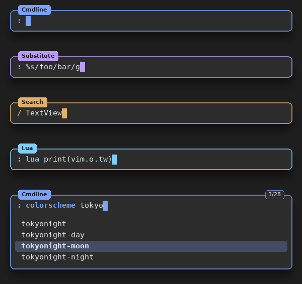

## Smooth scrolling

On by default, with Neovide's values. The scrolls nvim asks for glide instead
of jumping:
- `<C-d>`/`<C-u>`/`<C-f>`/`<C-b>`
- `zz`/`zt`/`zb`, `<C-e>`/`<C-y>`
- far jumps that move the window, like `G` and `n`

```lua
vim.g.vsneo_scroll_animation_length = 0.3     -- seconds; 0 = instant
vim.g.vsneo_scroll_animation_far_lines = 1    -- past one screen, only the last N lines animate
```

Details:
- **Long jumps stay fast.** Past one screen, only the last few lines animate,
  so `G` in a big file isn't a slow ride.
- **Folds don't stall it:** a collapsed fold counts as one line.
- **Holding `j`** past the edge stays instant; a chain of glides would lag
  the caret.
- **Wheel scrolling** is Visual Studio's own. The wheel cancels a glide
  instead of fighting it.

## Jump beacon

On by default. After a big jump, a bar in the cursor's color flashes from the
cursor to the right, then shrinks back into it while fading, like
beacon.nvim.

- **When:** a jump of at least `vsneo_beacon_min_jump` lines (`G`, `n`, `%`,
  F12, `<C-o>`, a far click), and when a document gains focus.
- **Never** in insert, replace or command-line mode, so Enter while typing
  doesn't flash.
- The bar rides a smooth scroll.

```lua
vim.g.vsneo_beacon = true
vim.g.vsneo_beacon_min_jump = 10    -- lines
vim.g.vsneo_beacon_width = 40       -- columns
vim.g.vsneo_beacon_duration = 0.4   -- seconds
```

## Mode-colored cursor line

Off by default. A faint wash of the current mode's color on the cursor line,
like modes.nvim, so you see the mode where you're looking.

```lua
vim.g.vsneo_mode_line = true
vim.g.vsneo_mode_line_opacity = 0.12
```

- Colors come from `vsneo_cursor_color` per mode, so the tint, cursor, trail
  and beacon agree.
- Modes without a color use modes.nvim's palette: teal for insert, red for
  replace, purple for visual, amber for operator-pending. Normal mode stays
  plain unless you give it a color.
- Switching modes cross-fades the color over 120 ms.

## Relative line numbers

VSNeo's line-number margin follows Neovim's own options, live:

```lua
vim.o.relativenumber = true
vim.o.number = true   -- the cursor line shows its absolute number; without it, 0, as in Vim
```

The cursor line's number is drawn like Vim's `CursorLineNr`: bold, brighter,
left-aligned when it's the absolute number, and in the mode color while the
mode line is on. Typing on one line doesn't repaint the margin.

Visual Studio can override it: **Tools > Options > VSNeo > Editor > Relative
line numbers** (`FollowNeovim`, `AlwaysOn`, `AlwaysOff`).

## Do not disturb

One switch turns every animation and effect off: trail, effects, smooth
scrolling, beacon, custom cursor, glow and mode line. You get Visual Studio's
plain caret.

```vim
:VSNeoDnd        " toggle
:VSNeoDnd on
:VSNeoDnd off
```

Or `vim.g.vsneo_dnd = true` in the rc. Your settings are kept and come back
when it's off, and it wins over presets too. A handy mapping:

```lua
vim.keymap.set('n', '<leader>z', '<Cmd>VSNeoDnd<CR>', { desc = 'Focus: animations off/on' })
```

## Performance

All of this is built to stay out of the way of typing:
- **Nothing runs while nothing moves.** The frame loops run only during an
  animation, and with everything off, nothing runs at all.
- **No work on the key path.** Caret and layout handlers only set flags; the
  drawing happens at frame time.
- **Cheap fades.** Effects fade through cached translucent brushes rather
  than WPF opacity layers, which made typing lag in an early version.
- **Caps:** 400 live particles per effect (200 for matrix), 150 per jump.

**Software rendering.** Normally these effects run on the GPU. When WPF falls
back to drawing on the CPU (Remote Desktop, a VM without a GPU, or Visual
Studio's hardware acceleration switched off), the costly parts stand down
automatically: effects, glow, smooth scrolling and the fading blink styles.
The trail, custom cursor, beacon and mode line stay. To override the
detection:

```lua
vim.g.vsneo_reduce_effects = false   -- never reduce; true = always reduce
```

**Windows animations.** Everything respects Windows' "Show animations in
Windows" setting: with it off, nothing moves.

## Troubleshooting

- **A preset or setting seems to change nothing.** Check that do not disturb
  is off (`:VSNeoDnd off`). Then check whether your rc sets the same option;
  [`options.md`](options.md#presets) explains which one wins.
- **No effects, no glow, no smooth scrolling.** You may be on software
  rendering (Remote Desktop, VM). `vsneo_reduce_effects = false` turns them
  back on; `%TEMP%\vsneo.log` says when the reduction kicked in.
- **Nothing animates at all.** Windows' "Show animations in Windows" is off,
  or the trail length is `0`.
- **The cursor line shows `0`.** Set `vim.o.number = true` along with
  `relativenumber`.
